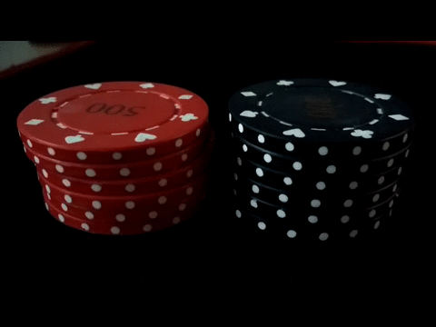
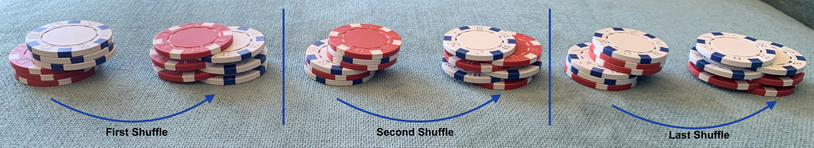
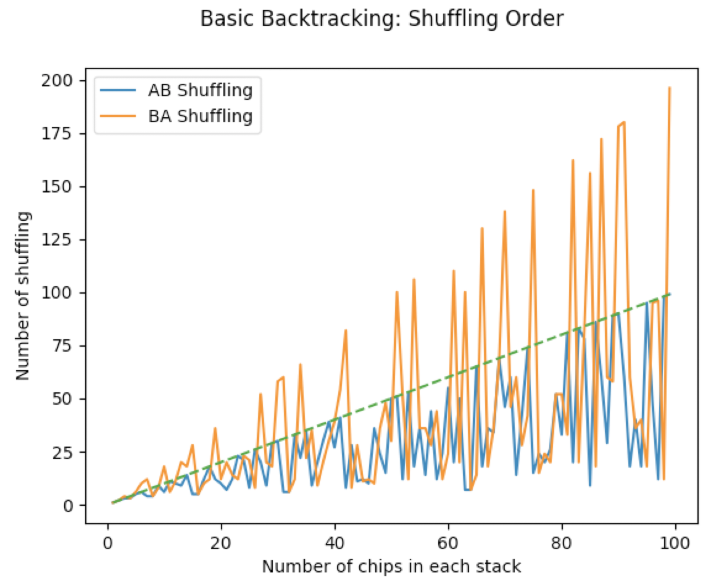

# Poker Chip Shuffling

When you sit at the poker table, you see players shuffle their chips constantly. There's cool tutorial on how to do that on [youtube 🌐](https://www.youtube.com/watch?v=pwfvsa1_3Qk). When you start to learn shuffling you start with a pair of 3 chips in two colors.

You easily discover that for a pair of 3 chips, you can get the colors separated by shuffling only three times:
Start with `wwwRRR` (`w` for a white chip, and `R` for a red chip, read from top of the stack)

- The first shuffle generates: `RwRwRw`
- The second shuffle generates: `wRRwwR`
- and the last shuffle gives you: `wwwRRR` again.

> Shuffling two stack of n=3 chips, left-to-right.

## How many shuffling does it take for a pair of N chips to be separated?

### Shuffling Order 

Before, I address this question, we need to know if the order of shuffling matters.

> Does it mater if you put the first chip down from the left stack (as in the first gif) or right stack (as in the second figure)?

I wrote a simple piece of code in [here](src/basic_backtrack.py) which compares different shuffling for all `n`s from 1-99:

In this experiment: 

- For each stack of `2n` chips, I test both shuffling orders: AB and BA.
  - **AB shuffling** puts the first chip down from right (top) stack
     - This is the shuffling that I do with real chips.
     - I tend to put the right chip down first.
     - check the figure with white/red chips.
  - **BA shuffling** puts the first chip down from the left (bottom) stack
  - I do not change shuffling order for the stack at every shuffling step. 

Observations:

- AB shuffling always finishes with fewer number of steps as the number of the chips in each stack (green line is the identity line).
- BA shuffling somtimes finishes with fewer steps than AB shuffling.

### Mixing Shuffling Orders

While the upper bound for the number of shufflings seems to be the number of chips in each color, we can get much smaller number of shuffling steps for a given set of chips.

A backtracking algorithm will try AB and BA shuffling at every shuffling step.