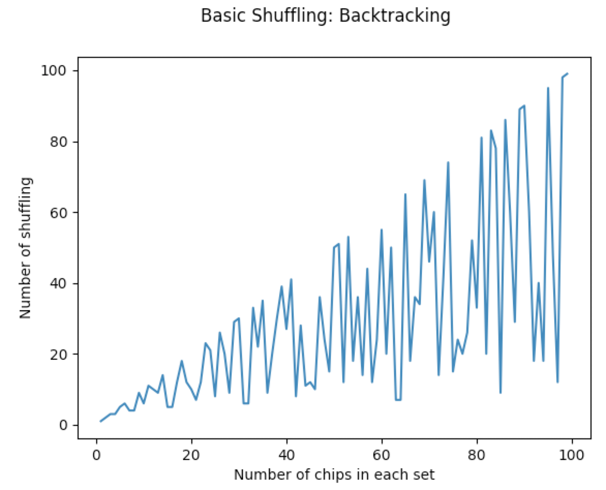

# Poker Chip Shuffling

When you sit at the poker table, you see players shuffle their chips constantly. There's cool tutorial on how to do that on [youtube 🌐](https://www.youtube.com/watch?v=pwfvsa1_3Qk). When you start to learn shuffling you start with a pair of 3 chips in two colors.

You easily discover that for a pair of 3 chips, you can get the colors separated by shuffling only three times:
Start with `wwwRRR` (`w` for a white chip, and `R` for a red chip, read from top of the stack)

- The first shuffle generates: `RwRwRw`
- The second shuffle generates: `wRRwwR`
- and the last shuffle gives you: `wwwRRR` again.

> Shuffling two stack of n=3 chips, left-to-right.

## How many shuffling does it take for a pair of N chips to be separated?

A simple piece of code in [here](src/basic_backtrack.py) results in:

