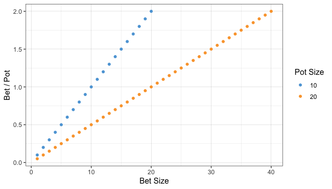
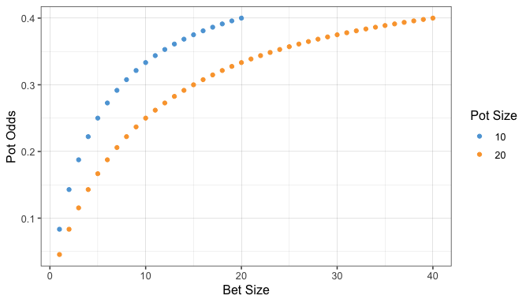
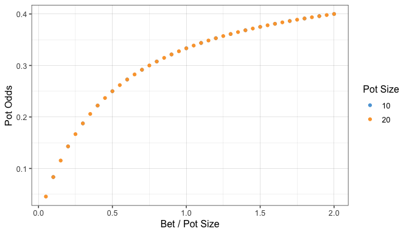
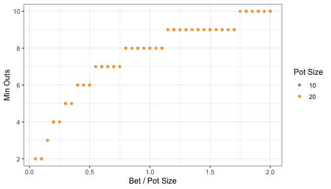

# How to Bet


<details>
<summary>Show Code</summary>

``` r
library(data.table)
library(ggplot2)
library(ggthemes)
knitr::opts_chunk$set(echo = TRUE, message = FALSE, fig.height = 4)
```

``` r
data <- data.table(pot=c(rep(10, 20), rep(20,40)), bet=c(1:20, 1:40))

ggplot(data, aes(bet, bet/pot, color=factor(pot))) + 
  geom_point() +
  theme_few() +
  scale_color_few(name='Pot Size') +
  theme(panel.grid = element_line(size=.05)) +
  labs(x='Bet Size', y='Bet / Pot')
```

</details>

<!-- -->

## Pot Odds

Pot Odds is how much you should pay to see the next card. If there’s 200
in the pot, and enemy bets 100, you have to call 100 to win 300, which
gives you the pot-odds of 3:1 or the probability of 1/4=25%.

So Pot odds probability is calculated as `bet / (pot + 2 * bet)`:

<details>
<summary>Show Code</summary>

``` r
data[, pot_odds := bet / (pot + 2 * bet)]

ggplot(data, aes(bet, pot_odds, color=factor(pot))) + 
  geom_point() +
  theme_few() +
  scale_color_few(name='Pot Size') +
  theme(panel.grid = element_line(size=.05)) +
  labs(x='Bet Size', y='Pot Odds')
```

</details>

<!-- -->

you can see that the pot-odds are dependant to bet size and pot size,
but their are independant of the portion of the pot is being betted:

<details>
<summary>Show Code</summary>

``` r
ggplot(data, aes(bet/pot, pot_odds, color=factor(pot))) + 
  geom_point() +
  theme_few() +
  scale_color_few(name='Pot Size') +
  theme(panel.grid = element_line(size=.05)) +
  labs(x='Bet / Pot Size', y='Pot Odds')
```

</details>

<!-- -->

That means:

- a bet of 1/3 of the pot, always give you a pot odds of
16%.
- a bet of 1/2 of the pot, always give you a pot odds of 25%.
- a pot size bet, always give you a pot odds of 33%.
- double the pot size, pushes the pot odds to 40%
- ...

## When should you call

You should call when your chances of winning is more than your pot odds.

For instance if:

- you hold an Ace, Queen
- your opponent has King Queen
- Flop is K 2 7

you only win with an Ace, which there are only 3 left *out* in the deck.

your chances of getting an Ace is 3 / 47 (\~6%) in turn and 3 / 46
(\~6%) in river.

For fast calculations people do `outs * 4` (on the turn, and `outs * 2`
on the river) which will give you 12% in this case.

You should only call if your chances of winning is **more** than the pot
odds.

## Minimum outs

The best strategy is to know what is the minumum *outs* you should have
to call a bet!

On Turn:

`outs / 47 + outs / 46 > Pot Odds`

which leads to

`outs > Pot Odds / (1/46 + 1/47)`

<details>
<summary>Show Code</summary>

``` r
data[, min_outs := ceiling(pot_odds / (1/46 + 1/47))]


ggplot(data, aes(bet/pot, min_outs, color=factor(pot))) + 
  geom_point() +
  theme_few() +
  scale_color_few(name='Pot Size') +
  theme(panel.grid = element_line(size=.05)) +
  labs(x='Bet / Pot Size', y='Min Outs')
```

</details>

<!-- -->

That means 

- to call a half pot size bet, you must at least have 6 outs.
- to call a pot size bet, you must have a 8 outs or more.

For out example case when you have 3 outs (3 remaining Aces), you can
only call if the bet size is less than 15% of the potsize


``` r
data[min_outs==3, scales::percent(bet/pot)]
```

 "15.0%"
